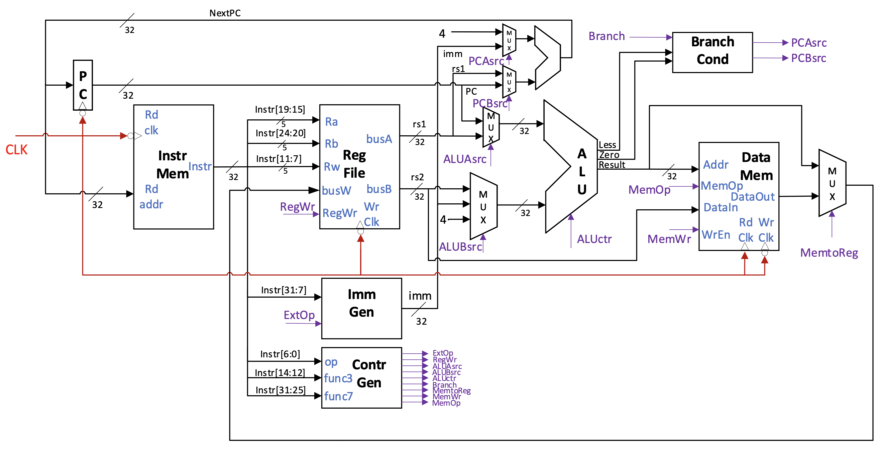
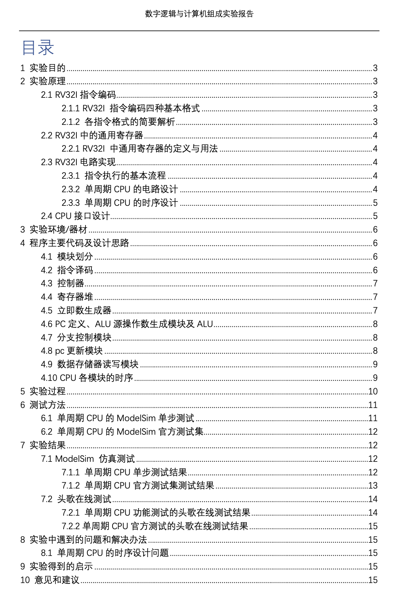
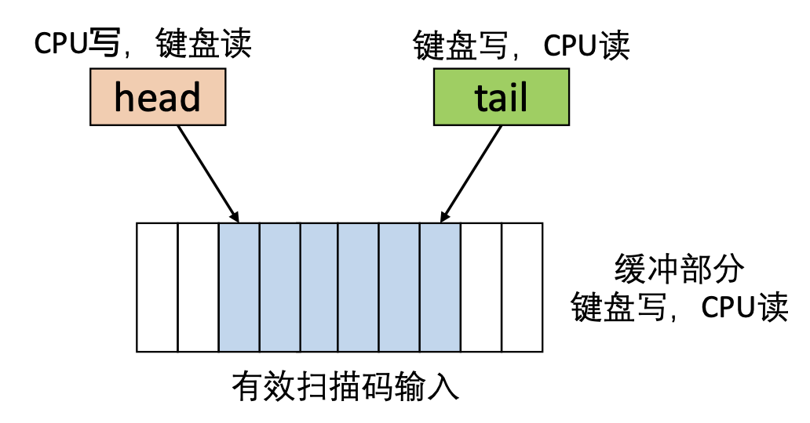
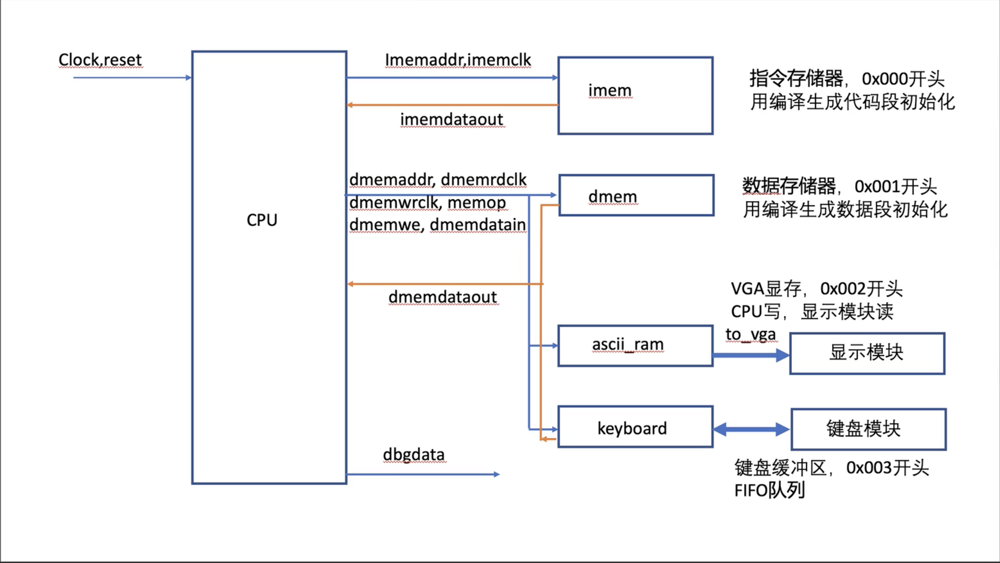

# NJU-RV32I

**201220014 崔家才**

201220014@smail.nju.edu.cn


## 1 实验概述

本实验的目标是在`DE10-Standard`开发板的 FPGA 上实现一个简单的计算机系统，能够运行`RV32I`指令集，并处理一定量的输入输出。


## 2 硬件部分

### 2.1 CPU

`CPU`沿用实验十一中支持`RV32I`指令集的单周期`CPU`，基本设计如下图：



其具体设计细节和思路再实验十一的报告中已经有备述，这里不再赘述。

> 实验十一的报告也一同附在与本文件同一文件夹下。

实验十一报告目录如下，用作预览：




### 2.2 外设

#### 2.2.1 PS2键盘

`PS2`键盘的主要设计延用实验七，其在顶层模块中的接口如下：

```verilog
// PS2 Keyboard
wire[7:0] scancode, raw_ascii;
wire shift, ctrl, capslock;
keyboard mykeybd(
    .clk(clk),
    .clrn(rstps2),
    .ps2_clk(PS2_CLK),
    .ps2_data(PS2_DAT),
    .cur_key(scancode),
    .shift(shift),
    .ctrl(ctrl),
    .capslock(capslock)
);
ascii_rom myascii_rom(
    .address(scancode),
    .clock(clk),
    .q(raw_ascii)
);
check_case mycheck(
    .raw_ascii(raw_ascii),
    .capslock(capslock),
    .shift(shift),
    .asciicode(ascii_code)
);
assign LEDR[9:8] = {capslock, shift};
```

唯一不同的是为了便于`CPU`的延时读取，增加了一个`FIFO`缓冲区，以保证不会丢失输入。具体原理如下：



代码详见`RV32I/PS2/fifo.v`，其在顶层模块中的接口如下：

```verilog
// Keyboard FIFO -- Starts With 0x003
wire [7:0] ascii_code;
fifo myfifo(
    .ascii_code(ascii_code),
    .wrclk(clk),
    .rdclk(cpurdclk),
    .rden(keyrden),
    .rst(rstfifo),
    .dataout(keyascii)
);
```


#### 2.2.2 VGA显示器

`VGA`显示器读取字符缓存沿用了实验九的一部分内容，有所改进的地方是使用IP核代替了寄存器作为显存，并且模块本身不负责接收键盘输入，只负责忠实地将显存中的内容显示在屏幕上，至于显存的修改全部交由CPU完成。

VGA模块的顶层接口如下：

```verilog
// VGA Screen
wire [23:0] vga_data;
wire [9:0] h_addr, v_addr;
assign VGA_CLK = clk;
assign VGA_SYNC_N = 0;
vga_ctrl myvga(
    .pclk(clk),
    .reset(rstvga),
    .vga_data(vga_data),
    .h_addr(h_addr),
    .v_addr(v_addr),
    .hsync(VGA_HS),
    .vsync(VGA_VS),
    .valid(VGA_BLANK_N),
    .vga_r(VGA_R),
    .vga_g(VGA_G),
    .vga_b(VGA_B)
);
loadscreen myloader(
    .pclk(clk),
    .rst(rstvga),
    .ascii_code(smemoutdata),
    .h_addr(h_addr),
    .v_addr(v_addr),
    .rdclk(smemrdclk),
    .rdaddr(smemrdaddr),
    .vga_data(vga_data)
);
```

显存的顶层接口如下：

```verilog
// Screen Memory -- Starts With 0x002
wire [7:0] smemoutdata;
wire [11:0] smemrdaddr;
wire smemrdclk;
screen_ram mysmem(
    .data(cpudataout[7:0]),
    .rdaddress(smemrdaddr),
    .rdclock(smemrdclk),
    .wraddress(vaddr[11:0]),
    .wrclock(cpuwrclk),
    .wren(smemwren),
    .q(smemoutdata)
);
```


#### 2.2.3 时钟

时钟的基本设计和试验四相似，不同的地方在于将时钟的输出供给给CPU以`0x006`开头的虚拟地址处以供软件调用。其顶层接口如下：

```verilog
// CLOCK
wire clk1s, rco;
wire[3:0] h_t, h_o, m_t, m_o, s_t, s_o;
clk_1s myclk_1s(CLOCK_50, clk1s);
clock myclock(
    .en(1'b1),
    .clk(clk1s), 
    .rst(rsttime),
    .cin(24'd0),
    .hour_t(h_t),
    .hour_o(h_o),
    .min_t(m_t),
    .min_o(m_o),
    .sec_t(s_t),
    .sec_o(s_o),
    .rco(rco)
);
assign timereg = {h_t, h_o, m_t, m_o, s_t, s_o};
```


### 2.3 CPU与外设的交互

#### 2.3.1 外设内存映射设计

各外设的空间映射规则如下：

| 外设           | 内存映射虚拟地址            |
| -------------- | --------------------------- |
| 指令存储器     | `0x00000000` ~ `0x000fffff` |
| 数据存储器     | `0x00100000` ~ `0x001fffff` |
| 显存           | `0x00200000 ~ 0x0030077f`   |
| 键盘缓存       | `0x00300000`                |
| 七数码管寄存器 | `0x00400000`                |
| LED灯寄存器    | `0x00500000`                |
| 时钟           | `0x00600000`                |

CPU 在读写内存时，会将需要访问的 32 位地址放在数据地址总线上。此时，我们可以根据 CPU访问地址的高12位来判断要使用具体那一片内存。在写入时，只将对应内存的写使能置为有效。在读取的时候，可以从多片不同的存储器中同时读取，最终根据高12位地址选择合适的数据放在CPU的数据总线上即可。


#### 2.3.2 外设内存读写设计

在`2.1.3.1`所提到的外设中，指令寄存器、键盘缓存、时钟是**CPU只读型**，显存、七段数码管寄存器、LED灯寄存器是**CPU只写型**，数据存储器是**CPU同时需要读写型**。

总体架构图示如下：




### 2.4 硬件部分顶层设计

```verilog
module NJU_RV32I(

	//////////// CLOCK //////////
	input 		          		CLOCK2_50,
	input 		          		CLOCK3_50,
	input 		          		CLOCK4_50,
	input 		          		CLOCK_50,

	//////////// KEY //////////
	input 		     [3:0]		KEY,

	//////////// SW //////////
	input 		     [9:0]		SW,

	//////////// LED //////////
	output		     [9:0]		LEDR,

	//////////// Seg7 //////////
	output		     [6:0]		HEX0,
	output		     [6:0]		HEX1,
	output		     [6:0]		HEX2,
	output		     [6:0]		HEX3,
	output		     [6:0]		HEX4,
	output		     [6:0]		HEX5,

	//////////// VGA //////////
	output		          		VGA_BLANK_N,
	output		     [7:0]		VGA_B,
	output		          		VGA_CLK,
	output		     [7:0]		VGA_G,
	output		          		VGA_HS,
	output		     [7:0]		VGA_R,
	output		          		VGA_SYNC_N,
	output		          		VGA_VS,

	//////////// PS2 //////////
	inout 		          		PS2_CLK,
	inout 		          		PS2_CLK2,
	inout 		          		PS2_DAT,
	inout 		          		PS2_DAT2
);


	//////////// Reset //////////
	wire rstclk, rstcpu, rstps2, rstvga, rsttime;
	
	assign rstclk = SW[0];
	assign rstvga = SW[1];
	assign rstfifo = SW[2];
	
	assign rstcpu = ~KEY[0];
	assign rstps2 = KEY[1];
	assign rsttime = KEY[2];


	//////////// 25MHz Clock //////////
	wire clk;
	clkgen #(25000000) myclk(
		.clkin(CLOCK_50),
		.rst(rstclk),
		.clken(1'b1),
		.clkout(clk)
	);
	wire cpuclk;
	assign cpuclk = clk;


	//////////// CPU //////////
	
	// outputs:
	wire [31:0] imemaddr, vaddr;
	wire [31:0] cpudataout, dbgdata;
	wire imemclk, cpurdclk, cpuwrclk, we;
	wire [2:0] dmemop;
	// inputs:
	wire [31:0] imemdataout, cpudatain;

	rv32is myrv32i(
		.clock(cpuclk),
		.reset(rstcpu),
		.imemdataout(imemdataout),
		.dmemdataout(cpudatain),
		.imemaddr(imemaddr),
		.imemclk(imemclk),
		.dmemaddr(vaddr),
		.dmemdatain(cpudataout),
		.dmemrdclk(cpurdclk),
		.dmemwrclk(cpuwrclk),
		.dmemop(dmemop),
		.dmemwe(cpuwe),
		.dbgdata(dbgdata)
	);

	//////////// Main Memory //////////

	wire dmemwren, smemwren;
	assign dmemwren = cpuwe && vaddr[31:20] == 12'h001;
	assign smemwren = cpuwe && vaddr[31:20] == 12'h002;
	assign bcdwren = cpuwe && vaddr[31:20] == 12'h004;
	assign ledwren = cpuwe && vaddr[31:20] == 12'h005;
	
	assign keyrden = vaddr[31:20] == 12'h003;
	
	wire [31:0] dmemdataout;
	wire [7:0] keyascii;
	wire [23:0] timereg;
	assign cpudatain = vaddr[31:20] == 12'h003 ? {24'h0, keyascii} : (vaddr[31:20] == 12'h006 ? {8'h0, timereg} : dmemdataout);
	
	// Instruction Memory -- Starts With 0x000
	irom myirom(
		.address(imemaddr[14:2]),
		.clock(imemclk),
		.q(imemdataout)
	);

	// Data Memory -- Starts With 0x001
	dmem mydmem(
		.addr(vaddr),
		.dataout(dmemdataout),
		.datain(cpudataout),
		.rdclk(cpurdclk),
		.wrclk(cpuwrclk),
		.memop(dmemop),
		.we(dmemwren)
	);
	

	// Screen Memory -- Starts With 0x002
	wire [7:0] smemoutdata;
	wire [11:0] smemrdaddr;
	wire smemrdclk;
	screen_ram mysmem(
		.data(cpudataout[7:0]),
		.rdaddress(smemrdaddr),
		.rdclock(smemrdclk),
		.wraddress(vaddr[11:0]),
		.wrclock(cpuwrclk),
		.wren(smemwren),
		.q(smemoutdata)
	);
	

	// Keyboard FIFO -- Starts With 0x003
	wire [7:0] ascii_code;
	fifo myfifo(
		.ascii_code(ascii_code),
    	.wrclk(clk),
    	.rdclk(cpurdclk),
    	.rden(keyrden),
    	.rst(rstfifo),
    	.dataout(keyascii)
	);
	
	// BCD REG -- Starts With 0x004
	reg[23:0] bcdreg;
	always @(posedge cpuwrclk) begin
		if (bcdwren) begin
			bcdreg <= cpudataout[23:0];
		end
	end
	
	// LED REG -- Starts with 0x005
	reg[7:0] ledreg;
	always @(posedge cpuwrclk) begin
		if (ledwren) begin
			ledreg[vaddr[2:0]] <= cpudataout[0];
		end
	end
	
	// Time REG -- Starts with 0x006
	
	
	

	//////////// External Device //////////

	// PS2 Keyboard
	wire[7:0] scancode, raw_ascii;
	wire shift, ctrl, capslock;
	keyboard mykeybd(
		.clk(clk),
		.clrn(rstps2),
		.ps2_clk(PS2_CLK),
		.ps2_data(PS2_DAT),
		.cur_key(scancode),
		.shift(shift),
		.ctrl(ctrl),
		.capslock(capslock)
	);
	ascii_rom myascii_rom(
		.address(scancode),
		.clock(clk),
		.q(raw_ascii)
	);
	check_case mycheck(
		.raw_ascii(raw_ascii),
		.capslock(capslock),
		.shift(shift),
		.asciicode(ascii_code)
	);
	assign LEDR[9:8] = {capslock, shift};

	
	// VGA Screen
	wire [23:0] vga_data;
	wire [9:0] h_addr, v_addr;
	assign VGA_CLK = clk;
	assign VGA_SYNC_N = 0;
	vga_ctrl myvga(
		.pclk(clk),
		.reset(rstvga),
		.vga_data(vga_data),
		.h_addr(h_addr),
		.v_addr(v_addr),
		.hsync(VGA_HS),
		.vsync(VGA_VS),
		.valid(VGA_BLANK_N),
		.vga_r(VGA_R),
		.vga_g(VGA_G),
		.vga_b(VGA_B)
	);
	loadscreen myloader(
		.pclk(clk),
		.rst(rstvga),
		.ascii_code(smemoutdata),
		.h_addr(h_addr),
		.v_addr(v_addr),
		.rdclk(smemrdclk),
		.rdaddr(smemrdaddr),
		.vga_data(vga_data)
	);
	

	// BCD SEG
	bcd7seg myseg0(bcdreg[3:0], HEX0);
	bcd7seg myseg1(bcdreg[7:4], HEX1);
	bcd7seg myseg2(bcdreg[11:8], HEX2);
	bcd7seg myseg3(bcdreg[15:12], HEX3);
	bcd7seg myseg4(bcdreg[19:16], HEX4);
	bcd7seg myseg5(bcdreg[23:20], HEX5);
	
	
	// LED Light
	assign LEDR[7:0] = ledreg[7:0];
	
	// CLOCK
	wire clk1s, rco;
	wire[3:0] h_t, h_o, m_t, m_o, s_t, s_o;
	clk_1s myclk_1s(CLOCK_50, clk1s);
	clock myclock(
		.en(1'b1),
		.clk(clk1s), 
		.rst(rsttime),
		.cin(24'd0),
		.hour_t(h_t),
		.hour_o(h_o),
		.min_t(m_t),
		.min_o(m_o),
		.sec_t(s_t),
		.sec_o(s_o),
		.rco(rco)
	);
	assign timereg = {h_t, h_o, m_t, m_o, s_t, s_o};
	

endmodule
```


## 3 软件部分

### 3.1 外设交互库函数的编写

当硬件部分的内存映射完成之后，软件只需要访问对应的内存就可以实现与外部设备的交互了。

```c
#define VGA_START 0x00200000
#define VGA_MAXLINE 30
#define VGA_MAXCOL 64

#define PS2_START 0x00300000

#define BCD_START 0x00400000
#define LED_START 0x00500000
#define LED_NUM 8
#define CLOCK_START 0x00600000

#define MAX_LEN 64
// 对于一些常量的定义

typedef unsigned int uint32_t;
typedef unsigned char uint8_t;

// 与VGA交互的库函数
void vga_init(void);
void putstr(const char* str);
void putch(char ch);
char getch(void);
void setline(uint32_t n);

// 与7段数码管交互的库函数
void initbcd(void);
void putbcd(uint32_t input);

// 与LED灯交互的库函数
void initled(void);
void ledon(uint32_t input);
void ledoff(uint32_t input);

// 与系统时钟交互的库函数
uint32_t gettime();
void puttime(uint32_t t);
```

上面只列出了需要和外设交互的库函数，在这些库函数之外还实现了一些程序运行本身常用的，但不需要和外设交互的库函数，具体如下：

```c
uint32_t strlen(const char* str);
int strcmp(const char* str1, const char* str2);
int strncmp(const char* str1, const char* str2, uint32_t size);
void strcpy(char* dest, const char* src);
void strncpy(char* dest, const char* src, uint32_t size);

uint32_t a2u(const char* str, uint32_t begin);
void u2a(char* dest, uint32_t src);
void i2a(char* dest, int src);
```


### 3.2 建立简单的shell结构

系统主循环代码如下：

```c
char c = getch();
while (1) {
    if (c) {
        if (c == 13) {
            if (pos) {
                buffer[pos] = 0;
                putch('\n');
                exec_cmd(buffer, pos);
            }
            pos = 0;
        }
        else if (c == 8) { if (pos) pos--; else putch(20); }
        else buffer[pos++] = c;
        putch(c);
    }
    c = getch();
};
```

上述循环一方面实现了读取键盘输入并回显的功能，另一方面也实现了不断执行命令的功能。我使用了一个`buffer`缓冲区来储存用户输入的命令，并使用`exec_cmd`函数执行处理缓存下来的命令，触发机制是当用户敲击回车键。

```c
void exec_cmd(const char* cmd, uint32_t size);
```

对于退格键会做特殊处理，清楚缓冲区中对应的内容。

至此，shell结构已经搭建完毕，下面只需要在`exec_cmd`函数中对于各种不同的命令作处理即可。


### 3.3 实现基本功能和一部分简单的拓展功能

| 命令        | 功能                                   | 异常                   |
| ----------- | -------------------------------------- | ---------------------- |
| `hello`     | 输出`Hello World!`                     | 一般不会出现异常       |
| `fib n`     | 输出第`n`个斐波那契数列                | 空参异常报错           |
| `time`      | 输出当前系统时间（格式为`时：分：秒`） | 一般不会出现异常       |
| `whoami`    | 输出当前用户`cuijiacai@nju:201220014`  | 一般不会出现异常       |
| `echo str`  | 输出`str`内容                          | 空参异常报错           |
| `clear`     | 清屏                                   | 一般不会出现异常       |
| `bcd n`     | 在七段数码管上以16进制输出10进制数`n`  | 空参异常报错           |
| `led on n`  | 打开`n`号LED灯                         | 空参异常或非法参数异常 |
| `led off n` | 关闭`n`号LED灯                         | 空参异常或非法参数异常 |

具体代码详见`OS/main.c`。


### 3.4 实现表达式求值和一些扩展运算

此处采取的表达式策略是利用栈结构实现的简单表达式求值，主要思路是中缀表达式转逆波兰表达式，之后逆波兰表达式求值。

```c
int expr(const char* str);
void insert_operand(int* operand, int* top_num, int num);
void insert_oper (char * oper , int *top_oper , char ch);
int compare(char* oper, int* top_oper, char ch);
void deal_date(int* operand, char* oper, int* top_num, int* top_oper);
```

主要构成如上，代码细节详见`main.c`。

在实现表达式求值的时候发现乘除运算并不为指令集所支持，故而又以软件的形式实现了乘除运算，下面以除法为例，详见`OS/mul.c`。

```c
unsigned int __udivsi3(unsigned int a, unsigned int b) {
    unsigned int bit = 1, res = 0;
    while (b < a && bit && !(b & (1UL << 31))) { b <<= 1; bit <<= 1; }
    while (bit) {
        if (a >= b) { a -= b; res |= bit; }
        bit >>= 1; b >>= 1;
    }
    return res;
}

int __divsi3(int a, int b) {
    if (a >= 0 && b > 0) return (int)__udivsi3(a, b);
    if (a >=0 && b < 0) return -(int)__udivsi3(a, -b);
    if (a < 0 && b > 0) return -(int)__udivsi3(-a, b);
    if (a < 0 && b < 0) return (int)__udivsi3(-a, -b);
}
```


## 4 最终效果


## 5 实验感悟


